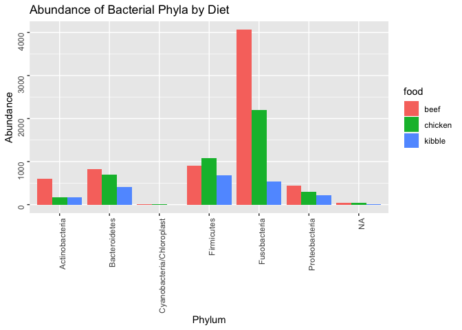
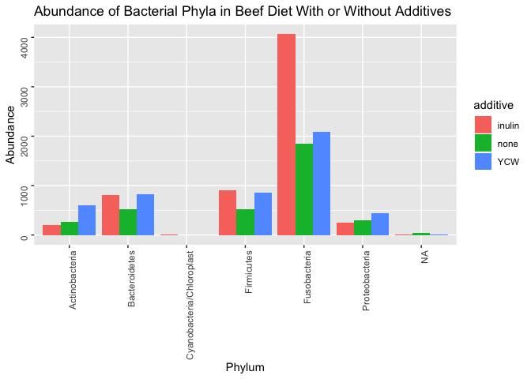
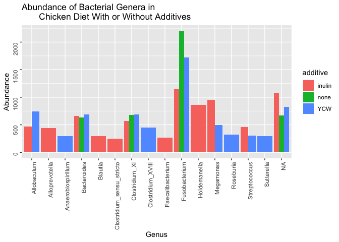
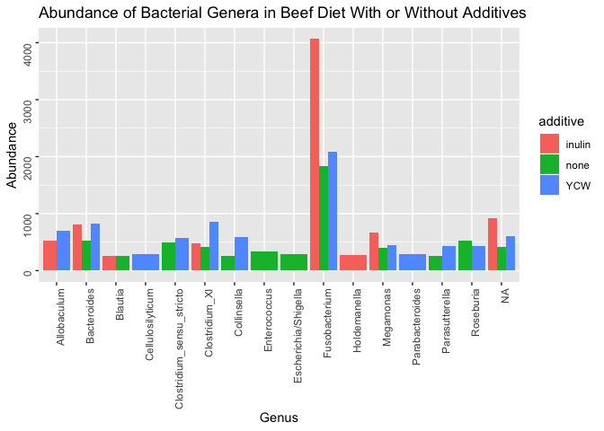

Final Report: Effects Of Kibble And Raw Meat Diets With Or Without Additives On Fecal Microbial Communities Of Healthy Adult Beagles
================
Emre Ovet
December 5, 2018

Introduction
============

Dogs have been the companion of humans since their first taming thousands of years ago (Savolainen *et al.*, 2002). Their role in human life is very remarkable as they offer protection and friendship to their owners, whereas their owners offer shelter and food to them. For every dog owner, the health of their dog is an important topic, and one of the most important factors in dogs' health is diet, as feeding them with a wrong diet might cause diseases that might affect their cardio-vascular or digestive systems (Moore and Withrow, 1982). While setting up a diet, it is important the consider the species and age of the animal as well as if the animal has a particular medical condition. Another important factor on dogs' diet is to whether feed them with processed or raw foods, but there are different opinions on whether processed or raw foods are safer for consumption. Processed dog foods such as kibbles or canned meats are known to be safer in terms of bacterial contamination, but most of them contain high amounts of preservatives and low amounts of nutrients (Alomar *et al.*, 2006). Moreover, they are subject to bacterial contamination as they are exposed to air and sunlight over time. Raw dog foods are usually contain a combination of meat, dairy products, vegetables and fruits and are known to be much nutritious than the processed foods, but they are much more vulnerable to bacterial contamination, thus, they need to be prepared in hygienic environments, kept frozen or freshly consumed by dogs (Finley *et al.*, 2007). In order to find out the effects of raw meat and kibble diets on the gut bacterial microbiota, that is, the abundances of bacterial communities in guts of dogs, Beloshapla and her colleagues conducted a research project on dogs by feeding them with different raw diets of chicken and beef meat and with kibble diet over a period of time and then collecting samples from their feces (Beloshapka *et al.*, 2013). They also included fermentable fiber additives that may beneficially alter the gut microbiota, inulin and yeast cell wall, to some of the raw diets in order to see if it'll have a further effect. They found out that the Beef-based diets increased *Escherichia* abundance, but decreased *Anaerobiospirillum* abundance when compared to chicken-based diets. Moreover, inulin decreased *Enterobacteriaceae* abundance and increased *Megamonas* abundance when compared to raw diets without additives (Beloshapka *et al.*, 2013). Inulin also decreased *Escherichia* and *Lactobacillus* abundances when compared to yeast cell wall, whereas yeast cell wall increased *Bifidobacterium* abundance compared to inulin (Beloshapka *et al.*, 2013). In the light of the findings of Beloshapka et al., we decided to further analyse this data and ask "Which one of the diets prepared by Beloshapka et al., that are raw chicken with inulin, raw chicken with yeast cell wall, raw chicken with no additives, raw beef with inulin, raw beef with yeast cell wall, raw beef with no additives or kibble, will lead to lowest abundance of pathogenic bacteria in dog guts?" We'll hypothesize that the beef diet with inulin leads to the highest abundance of pathogenic bacteria. We believe that this is a significant topic because by finding out the diet that leads to the highest abundance of pathogenic bacteria in dog guts, we can encourage the dog owners not to feed their dogs on that diet which would result in a decrease in the digestive diseases among dogs that is caused by pathogenic bacteria. This would further decrease the number of dog deaths related to digestive diseases and all the dogs around the world would have an increased life quality. In order to test our hypothesis, we'll download the SRA files of this experiment from NCBI and create plots using the data and metadata. We'll create bar plots on the abundance of bacterial phyla by diet overall, by raw chicken diet with or without additives and by raw beef with or without additives in order to see if any unusual phylum of bacteria that is pathogenic present in the fecal samples in respect to the diet. After that, we'll create bar plots on the abundance of bacterial genera by diet overall, by raw chicken diet with or without additives and by raw beef with or without additives to see how many different pathogenic bacterial genera does the fecal samples have in respect to the diet.

Methods
=======

Study design
------------

In the research study of Beloshapka et al., 6 spayed female, healthy adult beagle dogs with ages varying from 5 to 6 years were used. Six raw diets, based on animal meats and organs, eggs, fruits, and vegetables, were formulated by Beloshapka et al to contain approximately 25–30% crude protein and 45–50% fat (Beloshapka *et al.*, 2013). The formulated diets were beef control, beef with 1.4% inulin dry matter basis, beef with 1.4% yeast cell wall, chicken control, chicken with 1.4% inulin and chicken with 1.4% yeast cell wall. It is not included in the paper what organs, fruits and vegetables were used in those raw diets and what were the portions of each ingredient, what brand of kibble was used and what was the ingredients of the kibble. Dogs were fed twice daily, first at 8:00 AM and then at 17:00 PM with either formulated raw diets or kibble. The diets were truly raw and were not treated for pathogens and they were kept frozen and thawed under refrigeration in storage containers 2 days prior to feeding. Sub samples of all six thawed diets were submitted to the University of Illinois Veterinary Medicine Diagnostic Laboratory for general cultures, all of which came back negative or below detectible limits (Beloshapka *et al.*, 2013).

Sample origin and sequencing
----------------------------

Following a 14-day adaptation period, one fresh fecal sample was collected by Beloshapka et al. within 15 min of defecation on either day 15 or day 16 of each period. It is not included in the paper what method and equipment they used to collect the fecal samples. The fresh feces were weighed and aliquoted into sterile cryogenic vials and frozen at −80 °C until DNA extraction (Beloshapka *et al.*, 2013).

Genomic DNA was extracted by Beloshapka et al. using the repeated bead beater method with QIAamp DNA Stool Mini DNA extraction Kit. Once the DNA was eluted, all samples were purified using the QIAquick PCR Purification Kit. Extracted DNA was quantified using NanoDrop ND-1000 spectrophotometer. Genomic DNA quality was assessed using agarose gel electrophoresis (Beloshapka *et al.*, 2013). Genomic DNA was diluted to 20 ng μL−1 in preparation for 454-pyrosequencing. Bacterial tag-encoded FLX-Titanium amplicon pyrosequencing based upon the V4-V6 region of the 16S rRNA gene was performed. The 16S rRNA universal Eubacterial primers 530F and 1100R were used to amplify the 600-bp region. In preparation for FLX-Titanium sequencing, DNA fragment size and concentration were accurately measured using DNA chips under a Bio-Rad Experion Automated Electrophoresis Station and a TBS-380 Fluorometer. A four-region 454 sequencing run was performed on a GS PicoTiterPlate using the Genome Sequencer FLX System.

Beloshapka et al. used quantitative polymerase chain reaction to measure the abundance of *Bifidobacterium* and *Lactobacillus*. Fecal samples were extracted using ZR Fecal DNA Extraction Kit along with SYBR-based reaction mixtures. PCR conditions were 95°C for 2 minutes and 40 cycles at 95°C for 5 seconds and 10 seconds at 60°C for *Bifidobacterium* and were 58°C for *Lactobacillus*. A melt curve analysis was performed for 1 minute at 95 °C, 1 minute at 55 °C, and 80 cycles of 0.5°C increments each 10 seconds. The PCR conditions were 95 °C for 20 seconds, 40 cycles at 95 °C for 5 seconds, and 10 seconds at the optimized annealing temperature.

Computational
-------------

I downloaded fastq files from NCBI with accession code PRJNA186650. Then, I installed general-use packages from GitHub and bioconductor. I set the base path for my input data files from fecal microbial community study, sorted the path to ensure samples are in order, extracted sample names and specified the full path for each of the filenames forward reads. Next, I used DADA2, a software package that corrects and models Illumina-sequenced amplicon errors to plot the quality profiles of each sample (Callahan *et al.*, 2016). After checking those quality profiles,I created a diretory called "filtered\_reads\_path", placed my filtered files inside the filtered/ subdirectory and trimmed the lower quality sequences using DADA2 (Callahan *et al.*, 2016). Then, I generated a table of read counts before and after trimming. This was followed by building error models from each of the samples and visualizing errors with plots to make sure error models matched my data. After checking the plots, I removed all the replicated sequences to increase DADA2's accuracy (Callahan *et al.*, 2016). Next, I named the dereplicated class objects by the sample names. I ran DADA to apply the core sample inference algorithm to the dereplicated data (Callahan *et al.*, 2016). After DADA2 ran succesfully, I created an histogram of sequence lenghts to check the distribution of trimmed and denoised sequences. Then, I removed the chimeras from my cleaned reads to obtain just non-chimeric reads. After that, I builded a table of pipeline read counts to see how many sequences remain at each step of the pipeline. Next, I assigned taxonomy to each sequence variant. After assigning taxonomy, I extracted sequences to Fasta and builded a phylogeny using DADA2 (Callahan *et al.*, 2016). Finally, I read in the phylogeny and construct a phyloseq object by using the phyloseq package, a tool to import, store, analyze, and graphically display complex phylogenetic sequencing data (McMurdie and Holmes, 2013). After completing all these steps, I melted and saved the phyloseq. For generating plots, I used ggplot.

Results
=======

As a result of our analysis, we found out that the major bacterial phyla in fecal samples are Actinobacteria, Bacteroidetes, Firmicutes, Fusobacteria and Proteobactera regardless of the diet and additives (Figure 1, Figure 2, Figure 3). Beef diet fecal samples have the highest abundances of each bacterial phyla compared to chicken and kibble diet samples except for Firmicutes, which is the highest in chicken diet fecal samples (Figure 1). The abundances of each bacterial phyla in chicken fecal diet samples are always between the abundances of beef and kibble diet fecal samples, except for Firmucutes (Figure 1). Kibble diet fecal samples have the lowest abundances of each bacterial phyla compared to beef and chicken diet fecal samples with no exception (Figure 1). Inulin added chicken diet fecal samples have increased abundances of Actinobacteria and Firmicutes and decreased abundance of Fusobacteria compared to control chicken diet fecal samples (Figure 2). Yeast cell wall added chicken diet fecal samples have increased abundances of Proteobacteria and Firmicutes and decreased abundances of Actinobacteria and Fusobacteria compared to control chicken diet fecal samples (Figure 2). Inulin added beef diet fecal samples have increased abundances of Bacteriodetes, Firmicutes and Fusobacteria and decreased abundances of Actinobacteria and Proteobacteria compared to control beef fecal samples (Figure 3). Yeast cell wall added beef diet fecal samples have increased abundances of Actinobacteria, Bacteroidetes, Fusobacteria and Proteobacteria compared to control beef fecal samples (Figure 3). In genus level, we found out that *Fusobacterium* is the most abundant genus in all raw meat diet fecal samples (Figure 4, Figure 5 Figure 6). In kibble diet fecal samples, the most abundant bacterial genera are *Allobaculum*, *Fusobacterium* and *Lactobacillus* (Figure 4). An interesting finding is that all the Fusobacteria phylum abundance among all fecal samples is composed of only *Fusobacterium* genus as their abundances are equal in pylum and genus level among all kibble and raw diet fecal samples (Figure 1, Figure 2, Figure 3, Figure 4, Figure 5, Figure 6). The Bacteroidetes abundance among raw diet fecal samples is composed of only *Bacteroides* genus as their abundances are equal in pylum and genus level among all raw diet fecal samples, but the abundance of Bacteroidetes phylum is higher than the abundance of *Bacteroides* abundance among kibble fecal diet samples so there must be another genus that belongs to Bacteroidetes phylum among them (Figure 1, Figure 2, Figure 3, Figure 4 Figure 5, Figure 6). There are high abundances of unidentified genera among all fecal samples which is not expected (Figure 4, Figure 5, Figure 6). Beef diet fecal samples lack *Alloprevotella*, *Anaerobiospirillum*, *Clostridium\_XVII*, *Faecalibacterium*, *Lactobacillus*, *Prevotella*, *Streptococcus*, *Sutterella* and *Tuticibacter* but they possess unique genera such as *Collinsella*, *Enterococcus*, *Escherichia*, *Parabacteroides*, *Cellulosilyticum* and *Parasutterella* (Figure 4). Chicken diet fecal samples lack *Collinsella*, *Enterococcus*, *Escherichia*, *Parabacteroides*, *Cellulosilyticum*, *Parasutterella*, *Lactobacillus*, *Prevotella* and *Tuticibacter* but they possess *Anaerobiospirillum*, *Clostridium\_XVII*, *Streptococcus* and *Sutterella* which doesn't appear in other diets (Figure 4), whereas Kibble diet fecal samples lack *Anaerobiospirillum*, *Clostridium\_XVII*, *Streptococcus*, *Sutterella*, *Collinsella*, *Enterococcus*, *Escherichia*, *Parabacteroides*, *Cellulosilyticum* *Parasutterella*, *Blautia*, *Clostridium\_sensu\_stricto*, *Megamonas* and *Roseburia* but they possess *Lactobacillus*, *Prevotella* and *Tuticibacter* (Figure 4). Inulin added chicken diet fecal samples decreased abundances of *Fusobacterium* and *Clostridium\_XVII* when compared to control chicken diet fecal samples and also inulin allowed propagation of additional genera like *Allobaculum*, *Megamonas*, *Streptococcus*, *Alloprevotella*, *Blautia*, *Clostridium\_sensu\_stricto*, *Faecalibacterium* and *Holdemanella* which doesn't appear in control chicken fecal samples (Figure 5). Yeast cell wall added diet fecal samples increased the abundance *Fusobacterium* when compared to control chicken diet fecal samples and also yeast cell wall allowed propagation of additional genera like *Allobaculum*, *Megamonas*, *Streptococcus*, *Anaerobiospirillum*, *Clostridium\_XVII*, *Roseburia* and *Sutterella* that are specific to this additive diet (Figure 5). Inulin added beef diet fecal samples increased abundance of *Bacteroides*, *Fusobacterium* and *Megamonas* when compared to control beef diet fecal samples (Figure 6). Moreover, inulin allowed propagation of additional genera like *Allobaculum* and *Holdemanella* that is not found in control beef diet fecal samples and prevented propagation of genera like *Clostridium\_sensu\_stricto*, *Collinsella*, *Enterococcus*, *Escherichia*, *Parasutterella* and *Roseburia* which does appear in control beef diet fecal samples normally (Figure 6). Yeast cell wall added beef diet fecal samples increased abundances of *Bacteroides*, *Clostridium\_XI*, *Fusobacterium*, *Collinsella* and *Parasutterella* when compared to control beef diet fecal samples (Figure 6). Moreover, yeast cell wall allowed propagation of additional genera like *Allobaculum*, *Cellulosilyticum* and *Parabacteroides* which doesn't appear in control beef diet fecal samples and prevented propagation of genera *Blautia* which does appear in control beef diet fecal samples normally (Figure 6).

**Figure 1** Barplot of abundance of bacterial phyla in the dog fecal samples by diet. Colors were used to differ the data obtained by each fecal sample group in respect to the diet. These diets are raw beef, raw chicken and kibble. Data on raw diets contain the information for inulin added raw diets, yeast cell wall added raw diets and non additive raw diets as a whole.

In figure 1, we can see that Fusobacteria phylum is the most abundant phylum in beef and chicken diet fecal samples with 4100 and 2300 sequence reads, respectively. Firmicutes is the most abundant phylum among the kibble diet fecal samples with 700 sequence reads. Actinobacteria phylum is significantly high in beef diet fecal samples than the rest of the fecal samples with 600 sequence reads. Kibble diet fecal samples has overall the lowest abundances in each bacterial phyla. There is a small abundance of Cyanobacteria in inulin and control chicken diet fecal samples which is close to 1, thus, negligible. There is also an abundance of unidentified phyla in each of the diet fecal samples varying from 1 to 5 sequence reads.

**Figure 2** Barplot of abundance of bacterial phyla in the dog fecal samples by chicken diet with or without additives. Colors were used to differ the data obtained by each fecal sample group in respect to the presence of additives. Additives include inulin and yeast cell wall. YCW in the additives section is the abbreviation of yeast cell wall. This figure is obtained by filtering out the data for the chicken diet fecal samples.

This figure is obtained by filtering out the data for the chicken diet fecal samples. In figure 2, we can see that chicken control diet fecal samples have the highest Fusobacteria abundance with 2400 sequence reads. Bacteriodetes abundance is almost equal in all additive and non additive samples as they are all between 800 and 900 sequence reads. Inulin has increased the abundance of Firmicutes and Actinobacteria phyla in fecal samples compared to control chicken and yeast cell wall, whereas yeast cell wall has increased the abundance Proteobacteriaa in fecal samples compared to control chicken and inulin. There is a small abundance of Cyanobacteria which is close to 1, thus, negligible. There is also an abundance of unidentified phyla in control chicken and yeast cell wall diet fecal samples varying from 1 to 5 sequence reads.

**Figure 3** Barplot of abundance of bacterial phyla in the dog fecal samples by beef diet with or without additives. Colors were used to differ the data obtained by each fecal sample group in respect to the presence of additives. Additives include inulin and yeast cell wall. YCW in the additives section is the abbreviation of yeast cell wall. This figure is obtained by filtering out the data for the beef diet fecal samples.

In figure 3, we can see that Fusobacteria abundance is significantly higher in inulin added diet fecal samples than the rest of the additive samples with 4100 sequence reads. No Cyanobacteria or Chloroplast is present in any of the groups. Inulin has increased the abundance of Fusobacteria in fecal samples compared to control beef and yeast cell wall, whereas yeast cell wall has increased the abundance of Actinobacteria and Proteobacteria compared to control beef and inulin. There is an abundance of unidentified phyla in control beef and inulin diet fecal samples varying from 1 to 5 sequence reads.

**Figure 4** Barplot of abundance of bacterial genera in the dog fecal samples by diet. Colors were used to differ the data obtained by each fecal sample group in respect to the diet. These diets are raw beef, raw chicken and kibble. Data on raw diets contain the information for inulin added raw diets, yeast cell wall added raw diets and non additive raw diets as a whole. The genera that has an abundance lower than 250 sequence reads were removed.

In figure 4, we can see that there is a high amount of unidentified genus among all groups. Abundance of *Fusobacterium* genus is significantly high in beef and chicken diet fecal samples, with 4100 and 2300 sequence reads, respectively. *Anaerobiospirillum*, *Clostridium\_XVII*, *Streptococcus* and *Sutterella* only appear in chicken diet fecal samples. *Collinsella*, *Enterococcus*, *Escherichia*, *Parabacteroides*, *Cellulosilyticum* and *Parasutterella* only appear in beef diet fecal samples. *Lactobacillus*, *Prevotella* and *Turicibacter* only appear in kibble diet fecal samples. *Alloprevotella* and *Faecalibacterium* appear in chicken and kibble diet fecal samples. *Blautia*, *Clostridium\_sensu\_stricto*, *Roseburia* and *Megamonas* appear in chicken and beef diet fecal samples. There is a high abundance of unknown bacterial genera in all diet fecal samples varying between 250 and 1100 sequence reads.

**Figure 5** Barplot of abundance of bacterial genera in the dog fecal samples by chicken diet with or without additives. Colors were used to differ the data obtained by each fecal sample group in respect to the presence of additives. Additives include inulin and yeast cell wall. YCW in the additives section is the abbreviation of yeast cell wall. The genera that has an abundance lower than 250 sequence reads were removed. This figure is obtained by filtering out the data for the chicken diet fecal samples.

In figure 5, we can see that abundance of *Fusobacterium* is the highest among control diet fecal samples with 2300 sequence reads. *Anaerobiospirillum*, *Clostridium\_XVII*, *Roseburia* and *Sutterella* only appear in yeast cell wall added diet fecal samples. *Alloprevotella*, *Blautia*, *Clostridium\_sensu\_stricto*, *Faecalibacterium* and *Holdemanella* only appear in inulin added diet fecal samples. *Allobaculum*, *Megamonas* and *Streptococcus* appear in inuline and yeast cell wall added diet fecal samples. There is a high abundance of unknown bacterial genera in all additive and non additive chicken diet fecal samples varying between 750 and 1200 sequence reads.

**Figure 6** Barplot of abundance of bacterial genera in the dog fecal samples by beef diet with or without additives. Colors were used to differ the data obtained by each fecal sample group in respect to the presence of additives. Additives include inulin and yeast cell wall. YCW in the additives section is the abbreviation of yeast cell wall. The genera that has an abundance lower than 250 sequence reads were removed. This figure is obtained by filtering out the data for the beef diet fecal samples.

In figure 6, we can see that abundance of *Fusobacterium* is the highest among inulin added diet fecal samples with 4100 sequence reads. *Cellulosilyticum* and *Parabacteroides* only appear in yeast cell wall added diet fecal samples. *Enterococcus* and *Escherichia* only appear in beef control diet fecal samples. *Holdemanella* only appear in inulin added diet fecal samples. *Allobaculum* appear in inulin and yeast cell wall added diet fecal samples. *Blautia* appear in inulin added and beef control diet fecal samples. *Clostridium\_sensu\_stricto*, *Collinsella*, *Parasutterella* and *Roseburia* appear in yeast cell added and beef control diet fecal samples. There is a high abundance of unknown bacterial genera in all additive and non additive beef diet fecal samples varying between 400 and 900 sequence reads.

Discussion
==========

Returning back to our central question, we asked "Which one of the diets prepared by Beloshapka et al., that are raw chicken with inulin, raw chicken with yeast cell wall, raw chicken with no additives, raw beef with inulin, raw beef with yeast cell wall, raw beef with no additives or kibble, will lead to highest abundance of pathogenic bacteria in dog guts?", then we hypothesized that beef with inulin would lead to highest abundance of pathogenic bacteria in dog guts. We found out that the major bacterial phyla in fecal samples are Actinobacteria, Bacteroidetes, Firmicutes, Fusobacteria and Proteobactera regardless of the diet and additives. According to similar diet experiments conducted on healthy dogs, the same phyla were observed as the major ones (Deng and Swanson, 2015; Suchodolski, 2011). This would show us that there are no unusual pathogenic bacterial phyla in our fecal samples. As we switch from phylum level to genus level, the genera we obtained from the fecal samples are *Allobaculum*, *Alloprevotella*, *Anaerobiospirillum*, *Bacteroides*, *Blautia*, *Cellulosilyticum*, *Clostridium\_sensu\_stricto*, *Clostridium\_XI*, *Collinsella*, *Enterococcus*, *Escherichia/Shigella*, *Fusobacterium*, *Holdemanella*, *Megamonas*, *Parabacteriodes*, *Parasutterella* and *Roseburia*. After analyzing the pathogenicity of each of those genera, we found out that most of them are not yet to be proven to cause diseases. However, we were able to find some pathogenic activity in some of the genera present in our fecal samples. For instance, *Anaerobiospirillum* turns out to be one of the pathogenic bacterial genera that causes bloody diarrhea in puppies (Misawa *et al.*, 2002). Moreover, several members of the *Escherichia* genus are known to cause enteric or extra-intestinal infections and gastrointestinal diseases like enteric colibacillosis in many animals, including dogs (Beutin, 1999; Drolet *et al.*, 1994). We also found out that several members of the *Clostridium* causes diarrhea in dogs (Marks *et al.*, 2002) and that *Streptococcus* genus has members which can cause localized infection or septicemia in dogs of all ages (Lamm *et al.*, 2010). For *Clostridium* genus our comparison of pathogenic genera, we'll only count *Clostridium\_sensu\_stricto* abundances as pathogenic since this genus comprise a very heterogeneous assemblage of bacteria that do not form a phylogenetically coherent group and that only the sub-branch *Clostridium\_sensu\_stricto* can be regarded as the one of the true representatives of the genus *Clostridium* (Gupta and Gao, 2009). In our analysis of abundance of genera by diets, we observed that beef diet fecal samples contain *Escherichia* with 250 sequence reads and *Clostridium\_sensu\_stricto* with 650 sequence reads whereas in chicken diet fecal samples, we observed that they contain *Anaerobiospirillum* with 250 sequence reads, *Streptococcus* with 490 sequence reads and *Clostridium\_sensu\_stricto* with 250 sequence reads. Even though chicken diet fecal samples have more pathogenic genera than beef diet fecal samples, the total abundances of the genera they have are close to each other. When we compare the raw diets with additives, inulin added chicken fecal samples have a higher abundance of pathogenic bacteria than the rest of chicken diets as they have *Clostridium\_sensu\_stricto* with 250 sequence reads and *Streptococcus* with 490 sequence reads whereas non additive beef diet fecal samples have a higher abundance of pathogenic bacteria than the rest of beef diets as they have *Clostridium\_sensu\_stricto* with 500 sequence reads and *Escherichia* with 250 sequence reads. Therefore, we can conclude that we obtained evidence which would support both inulin added chicken diet and non additive beef diet lead to highest abundance of pathogenic bacteria in dog guts. With these results, we are failed to support our hypothesis. However, there is still a high uncertainty in our findings as we don't know if the presence of pathogenic bacteria are caused by the raw meat or by the fruits, vegetables or eggs that added to these diets as we don't know how they were prepared and what was their concentration in the diets. There is also a possibility that these pathogenic bacteria were introduced to fecal samples from environment while the fecal samples were collected as we don't know the method and equipment used for collecting the samples. Another important fact is that we were not able to fully target the pathogenic bacterial genera in our samples as there is no enough information available for each phylum of bacteria. Moreover, the diet experiment is only conducted on 6 beagles between 5 and 6 years old. This is a very small population to make a satisfying conclusion on every dog species. Above all, the genera that we identified as pathogenic have members that can be classified as probiotic. According to a similar dog fecal bacteria study, a member of the *Streptococcus* genus, *Streptococcus alactolyticus*, was identified as a lactic acid bacterium are believed to have a major effect on their host's well-being (Rinkinen *et al.*, 2004; Vaughan *et al.*, 2002). It is certain that further research studies on the pathogenicity of bacterial genera located in dog gut are required to be able to have more reliable outcomes for studies like ours. Until then, we can focus more on the nutrient aspect of the dog diets, like the study of Carcifioni et al. who analyzed the effects of six different carbohydrate sources on dog diet digestibility from fecal samples and found out that the diets containing brewer’s rice and cassava flour presented the greatest digestibility of dry matter, organic matter and gross energy (Carciofi *et al.*, 2008). Another good example is the study of Sunvold et al. in which single sources of dietary fiber in dog food were evaluated by fermenting the fibrous substrates in vitro using dog feces as the source of inoculum and they found out that Organic matter disappearance was lowest for Solka Flocoat fiber and greatest for fructooligosaccharides and lactulose (Sunvold *et al.*, 1995). As further research studies on the pathogenicity of bacterial genera located in dog gut were conducted and we get more information, we can repeat this analysis with a new experiment in which a great number of dog subjects would be used to represent at least 15-20 different species. Moreover, a great number of raw diets formulated with different meats, organs, vegetables and fruits along with dry kibbles and canned dog foods would be compared as well.

Sources Cited
=============

Alomar,D. *et al.* (2006) Nutritional evaluation of commercial dry dog foods by near infrared reflectance spectroscopy. *Journal of animal physiology and animal nutrition*, **90**, 223–229.

Beloshapka,A.N. *et al.* (2013) Fecal microbial communities of healthy adult dogs fed raw meat-based diets with or without inulin or yeast cell wall extracts as assessed by 454 pyrosequencing. *FEMS microbiology ecology*, **84**, 532–541.

Beutin,L. (1999) Escherichia coli as a pathogen in dogs and cats. *Veterinary Research*, **30**, 285–298.

Callahan,B.J. *et al.* (2016) DADA2: High-resolution sample inference from illumina amplicon data. *Nature Methods*, **13**, 581–583.

Carciofi,A.C. *et al.* (2008) Effects of six carbohydrate sources on dog diet digestibility and post-prandial glucose and insulin response. *Journal of Animal Physiology and Animal Nutrition*, **92**, 326–336.

Deng,P. and Swanson,K.S. (2015) Gut microbiota of humans, dogs and cats: Current knowledge and future opportunities and challenges. *British Journal of Nutrition*, **113**, S6–S17.

Drolet,R. *et al.* (1994) Attaching and effacing and enterotoxigenic escherichia coli associated with enteric colibacillosis in the dog. *Canadian Journal of Veterinary Research*, **58**, 87.

Finley,R. *et al.* (2007) The risk of salmonellae shedding by dogs fed salmonella-contaminated commercial raw food diets. *The Canadian Veterinary Journal*, **48**, 69.

Gupta,R.S. and Gao,B. (2009) Phylogenomic analyses of clostridia and identification of novel protein signatures that are specific to the genus clostridiumsensu stricto (cluster i). *International journal of systematic and evolutionary microbiology*, **59**, 285–294.

Lamm,C.G. *et al.* (2010) Streptococcal infection in dogs: A retrospective study of 393 cases. *Veterinary pathology*, **47**, 387–395.

Marks,S.L. *et al.* (2002) Genotypic and phenotypic characterization of clostridium perfringens and clostridium difficile in diarrheic and healthy dogs. *Journal of veterinary internal medicine*, **16**, 533–540.

McMurdie,P.J. and Holmes,S. (2013) Phyloseq: An r package for reproducible interactive analysis and graphics of microbiome census data. *PLoS ONE*, **8**, e61217.

Misawa,N. *et al.* (2002) Isolation and characterization of campylobacter, helicobacter, and anaerobiospirillum strains from a puppy with bloody diarrhea. *Veterinary microbiology*, **87**, 353–364.

Moore,R. and Withrow,S. (1982) Gastrointestinal hemorrhage and pancreatitis associated with intervertebral disk diseases in the dog. *Journal of the American Veterinary Medical Association*, **180**, 1443.

Rinkinen,M.L. *et al.* (2004) Streptococcus alactolyticus is the dominating culturable lactic acid bacterium species in canine jejunum and feces of four fistulated dogs. *FEMS microbiology letters*, **230**, 35–39.

Savolainen,P. *et al.* (2002) Genetic evidence for an east asian origin of domestic dogs. *Science*, **298**, 1610–1613.

Suchodolski,J. (2011) Companion animals symposium: Microbes and gastrointestinal health of dogs and cats. *Journal of animal science*, **89**, 1520–1530.

Sunvold,G. *et al.* (1995) Dietary fiber for dogs: IV. in vitro fermentation of selected fiber sources by dog fecal inoculum and in vivo digestion and metabolism of fiber-supplemented diets. *Journal of animal science*, **73**, 1099–1109.

Vaughan,E.E. *et al.* (2002) The intestinal labs. In, *Lactic acid bacteria: Genetics, metabolism and applications*. Springer, pp. 341–352.
