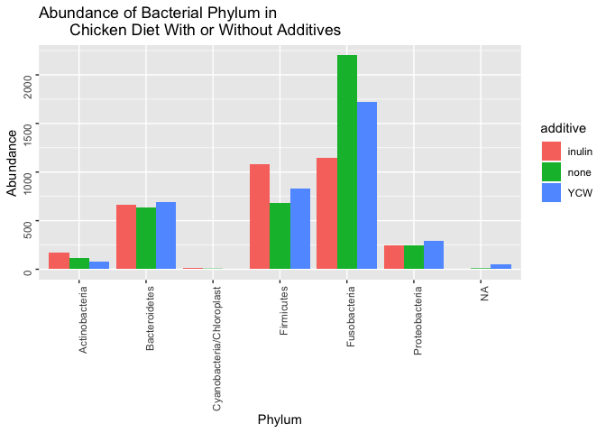
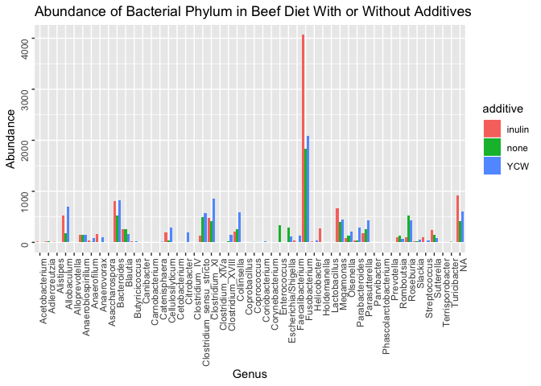
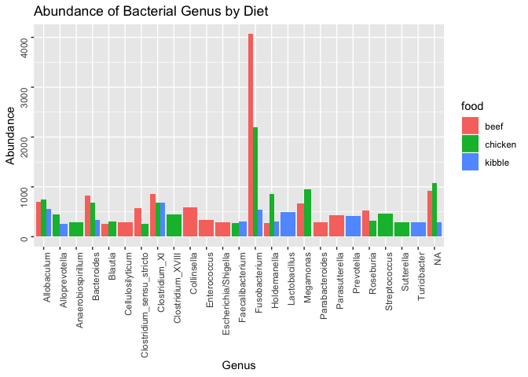
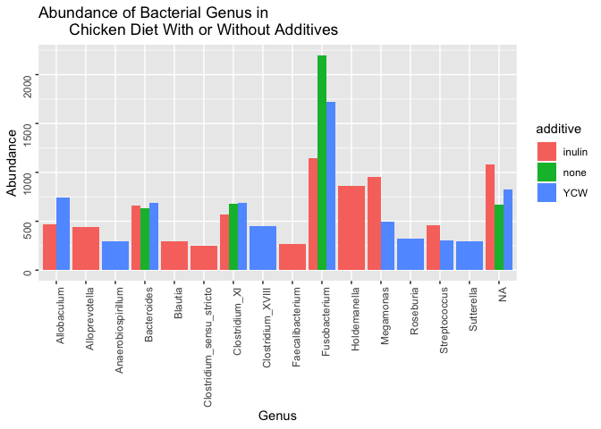

Final Report: Effects Of Kibble And Raw Meat Diets With Or Without Additives On Fecal Microbial Communities Of Healthy Adult Beagles
================
Emre Ovet
December 5, 2018

Introduction
============

Add about 2-3 pages here. Across the whole manuscript, you should cite at least 20 peer reviewed articles.

Methods
=======

Study design
------------

In the research study of Beloshapka et al., 6 spayed female, healthy adult beagle dogs with ages varying from 5 to 6 were used. Six raw diets, based on animal meats and organs, eggs, fruits, and vegetables, were formulated by Beloshapka et al to contain approximately 25–30% crude protein and 45–50% fat (Beloshapka *et al.*, 2013). The formulated diets were beef control, beef with 1.4% inulin dry matter basis, beef with 1.4% yeast cell wall, chicken control, chicken with 1.4% inulin and chicken with 1.4% yeast cell wall. Dogs were fed twice daily, first at 8:00 AM and then at 17:00 PM with either formulated raw diets or kibble. The diets were truly raw and were not treated for pathogens and they were kept frozen and thawed under refrigeration in storage containers 2 days prior to feeding. Subsamples of all six thawed diets were submitted to the University of Illinois Veterinary Medicine Diagnostic Laboratory for general cultures, all of which came back negative or below detectible limits (Beloshapka *et al.*, 2013).

Sample origin and sequencing
----------------------------

Following a 14-day adaptation period, one fresh fecal sample was collected by Beloshapka et al. within 15 min of defecation on either day 15 or day 16 of each period. The fresh feces were weighed and aliquoted into sterile cryogenic vials and frozen at −80 °C until DNA extraction (Beloshapka *et al.*, 2013).

Genomic DNA was extracted by Beloshapka et al. using the repeated bead beater method with QIAamp DNA Stool Mini DNA extraction Kit. Once the DNA was eluted, all samples were purified using the QIAquick PCR Purification Kit. Extracted DNA was quantified using NanoDrop ND-1000 spectrophotometer. Genomic DNA quality was assessed using agarose gel electrophoresis (Beloshapka *et al.*, 2013). Genomic DNA was diluted to 20 ng μL−1 in preparation for 454-pyrosequencing. Bacterial tag-encoded FLX-Titanium amplicon pyrosequencing based upon the V4-V6 region of the 16S rRNA gene was performed. The 16S rRNA universal Eubacterial primers 530F and 1100R were used to amplify the 600-bp region. In preparation for FLX-Titanium sequencing, DNA fragment size and concentration were accurately measured using DNA chips under a Bio-Rad Experion Automated Electrophoresis Station and a TBS-380 Fluorometer. A four-region 454 sequencing run was performed on a GS PicoTiterPlate using the Genome Sequencer FLX System.

Beloshapka et al. used quantitative polymerase chain reaction to measure the abundance of *Bifidobacterium* and *Lactobacillus*. Fecal samples were extracted using ZR Fecal DNA Extraction Kit along with SYBR-based reaction mixtures. PCR conditions were 95°C for 2 minutes and 40 cycles at 95°C for 5 seconds and 10 seconds at 60°C for *Bifidobacterium* and were 58°C for *Lactobacillus*. A melt curve analysis was performed for 1 minute at 95 °C, 1 minute at 55 °C, and 80 cycles of 0.5°C increments each 10 seconds. The PCR conditions were 95 °C for 20 seconds, 40 cycles at 95 °C for 5 seconds, and 10 seconds at the optimized annealing temperature.

Computational
-------------

I downloaded fastq files from NCBI with accession code PRJNA186650. Then, I installed general-use packages from GitHub and bioconductor. I set the base path for my input data files from fecal microbial community study, sorted the path to ensure samples are in order, extracted sample names and specified the full path for each of the filenames forward reads. Next, I used DADA2, a software package that corrects and models Illumina-sequenced amplicon errors to plot the quality profiles of each sample (Callahan *et al.*, 2016). After checking those quality profiles,I created a diretory called "filtered\_reads\_path", placed my filtered files inside the filtered/ subdirectory and trimmed the lower quality sequences using DADA2 (Callahan *et al.*, 2016). Then, I generated a table of read counts before and after trimming. This was followed by building error models from each of the samples and visualizing errors with plots to make sure error models matched my data. After checking the plots, I removed all the replicated sequences to increase DADA2's accuracy (Callahan *et al.*, 2016). Next, I named the dereplicated class objects by the sample names. I ran DADA to apply the core sample inference algorithm to the dereplicated data (Callahan *et al.*, 2016). After DADA2 ran succesfully, I created an histogram of sequence lenghts to check the distribution of trimmed and denoised sequences. Then, I removed the chimeras from my cleaned reads to obtain just non-chimeric reads. After that, I builded a table of pipeline read counts to see how many sequences remain at each step of the pipeline. Next, I assigned taxonomy to each sequence variant. After assigning taxonomy, I extracted sequences to Fasta and builded a phylogeny using DADA2 (Callahan *et al.*, 2016). Finally, I read in the phylogeny and construct a phyloseq object by using the phyloseq package, a tool to import, store, analyze, and graphically display complex phylogenetic sequencing data (McMurdie and Holmes, 2013). After completing all these steps, I melted and saved the phyloseq. For generating plots, I used ggplot.

Results
=======

Subsections are ok in the results section too
---------------------------------------------

``` r
# load packages as needed
library("dplyr")
```

    ## 
    ## Attaching package: 'dplyr'

    ## The following objects are masked from 'package:stats':
    ## 
    ##     filter, lag

    ## The following objects are masked from 'package:base':
    ## 
    ##     intersect, setdiff, setequal, union

``` r
library("tidyr")
library("knitr")
library("ggplot2")
library("citr")
library("dada2")
```

    ## Loading required package: Rcpp

``` r
library("seqinr")
```

    ## 
    ## Attaching package: 'seqinr'

    ## The following object is masked from 'package:dplyr':
    ## 
    ##     count

``` r
library("mctoolsr")
```

    ## You're using mctoolsr (v.0.1.1.2). Direct inquiries to:
    ## 'https://github.com/leffj/mctoolsr'

``` r
library("phyloseq")
```

    ## 
    ## Attaching package: 'phyloseq'

    ## The following object is masked from 'package:mctoolsr':
    ## 
    ##     plot_ordination

``` r
load("output/phyloseq_obj.Rdata")
load("output/melted_phyloseq.Rdata")
# load data produced from analysis scripts using
# something like load("output/processed_data.Rdata")
```

``` r
melted_phyloseq %>%
  ggplot(aes(x = Phylum, y = Abundance, fill = food)) +
  geom_col(position = position_dodge()) +
  theme(axis.text = element_text(angle = 90, hjust = 1)) +
ggtitle("Abundance of Bacterial Phylum by Diet")
```


**Figure 1**

In figure 1, we can see that Fusobacteria phylum is the most abundant phylum in beef and chicken diet fecal samples. Firmicutes is the most abundant phylum among the kibble diet fecal samples. Actinobacteria phylum is significantly high in beef diet fecal samples than the rest of the fecal samples.

``` r
melted_phyloseq %>%
  filter(food %in% c("chicken")) %>%
ggplot(aes(x = Phylum, y = Abundance, fill = additive)) +
  geom_col(position = position_dodge()) +
  theme(axis.text = element_text(angle = 90, hjust = 1)) +
ggtitle("Abundance of Bacterial Phylum in
       Chicken Diet With or Without Additives")
```



**Figure 2**

In figure 2, we can see that chicken control diet fecal samples have the highest Fusobacteria abundance. Bacteriodetes abundance is almost equal in all additive samples. Firmicutes abundance is the highest in inulin added chicken diet fecal samples.

``` r
melted_phyloseq %>%
  filter(food %in% c("beef")) %>%
ggplot(aes(x = Genus, y = Abundance, fill = additive)) +
  geom_col(position = position_dodge()) +
  theme(axis.text = element_text(angle = 90, hjust = 1)) +
ggtitle("Abundance of Bacterial Phylum in Beef Diet With or Without Additives")
```



**Figure 3**

In figure 3, we can see that Fusobacteria abundance is significantly higher in inulin added diet fecal samples than the rest of the additive samples. No Cyanobacteria or Chloroplast is present in any of the groups. Actinobacteria abundance is higher in yeast cell wall added beef diet fecal samples than the rest of the additive diet groups.

``` r
melted_phyloseq %>%
  filter(Abundance > 250) %>%
  ggplot(aes(x = Genus, y = Abundance, fill = food)) +
  geom_col(position = position_dodge()) +
  theme(axis.text = element_text(angle = 90, hjust = 1)) +
ggtitle("Abundance of Bacterial Genus by Diet")
```



**Figure 4**

In figure 4, we can see that there is a high amount of unidentified genus among all groups. Abundance of *Fusobacterium* genus is significantly high in beef and chicken diet fecal samples. *Anaerobiospirillum*, *Clostridium\_XVII*, *Streptococcus* and *Sutterella* only appear in chicken diet fecal samples. *Collinsella*, *Enterococcus*, *Escherichia*, *Parabacteroides* and *Parasutterella* only appear in beef diet fecal samples. *Lactobacillus*, *Prevotella* and *Turicibacter* only appear in kibble diet fecal samples. *Alloprevotella* and *Faecalibacterium* appear in chicken and kibble diet fecal samples. *Blautia*, *Clostridium\_sensu\_stricto*, *Roseburia* and *Megamonas* appear in chicken and beef diet fecal samples.

``` r
melted_phyloseq %>%
  filter(Abundance > 250) %>%
  filter(food %in% c("chicken")) %>%
ggplot(aes(x = Genus, y = Abundance, fill = additive)) +
  geom_col(position = position_dodge()) +
  theme(axis.text = element_text(angle = 90, hjust = 1)) +
ggtitle("Abundance of Bacterial Genus in
       Chicken Diet With or Without Additives")
```



**Figure 5**

In figure 5, we can see that abundance of *Fusobacterium* is the highest among control diet fecal samples. *Anaerobiospirillum*, *Clostridium\_XVII*, *Roseburia* and *Sutterella* only appear in yeast cell wall added diet fecal samples. *Alloprevotella*, *Blautia*, *Clostridium\_sensu\_stricto*, *Faecalibacterium* and *Holdemanella* only appear in inulin added diet fecal samples. *Allobaculum*, *Megamonas* and *Streptococcus* appear in inuline and yeast cell wall added diet fecal samples.

``` r
melted_phyloseq %>%
  filter(Abundance > 250) %>%
  filter(food %in% c("beef")) %>%
ggplot(aes(x = Genus, y = Abundance, fill = additive)) +
  geom_col(position = position_dodge()) +
  theme(axis.text = element_text(angle = 90, hjust = 1)) +
ggtitle("Abundance of Bacterial Genus in Beef Diet With or Without Additives")
```


**Figure 6**

In figure 6, we can see that abundance of *Fusobacterium* is the highest among inulin added diet fecal samples. *Cellulosilyticum* and *Parabacteroides* only appear in yeast cell wall added diet fecal samples. *Enterococcus* and *Escherichia* only appear in beef control diet fecal samples. *Holdemanella* only appear in inulin added diet fecal samples. *Allobaculum* appear in inulin and yeast cell wall added diet fecal samples. *Blautia* appear in inulin added and beef control diet fecal samples. *Clostridium\_sensu\_stricto*, *Collinsella*, *Parasutterella* and *Roseburia* appear in yeast cell added and beef control diet fecal samples.

Discussion
==========

Add around 3-4 pages interpreting your results and considering future directions one might take in analyzing these data.

Sources Cited
=============

Beloshapka,A.N. *et al.* (2013) Fecal microbial communities of healthy adult dogs fed raw meat-based diets with or without inulin or yeast cell wall extracts as assessed by 454 pyrosequencing. *FEMS microbiology ecology*, **84**, 532–541.

Callahan,B.J. *et al.* (2016) DADA2: High-resolution sample inference from illumina amplicon data. *Nature Methods*, **13**, 581–583.

McMurdie,P.J. and Holmes,S. (2013) Phyloseq: An r package for reproducible interactive analysis and graphics of microbiome census data. *PLoS ONE*, **8**, e61217.
